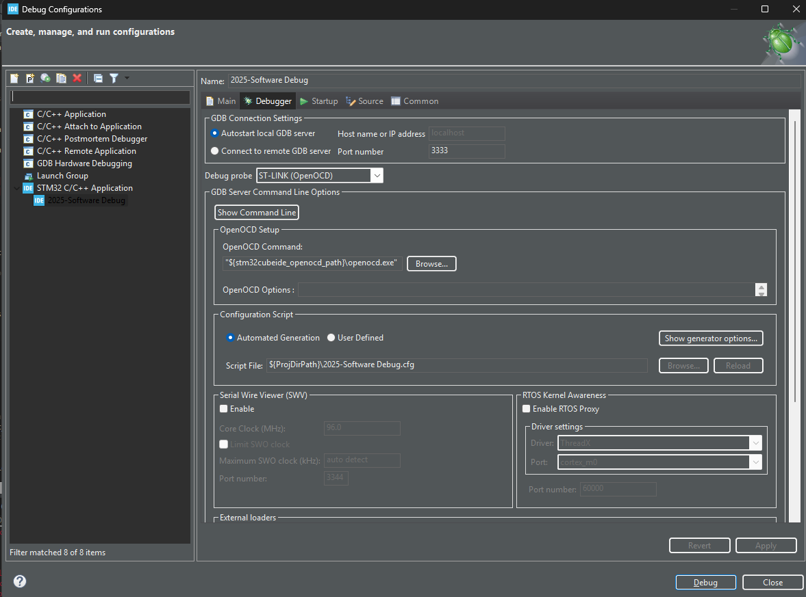

# 2025-software

## Development omgeving

De sofware wordt gemaakt in een STM32CubeIDE omgeving. 

### Assignments

- *USART3*: Serial port voor sturen van informatie
- *SYS*: Debug: Serial wire, Timebase Source: TIM1
- *RCC*: High speed clock and low speed clock based on cristals build in  
- *SPI1*: SD Card writer over SPI

#### PINS

| PIN  | Assignment  |
| ---- | ----------- |
| PA4  | SPI1_CS     |
| PA5  | SPI1_SCK    |
| PA6  | SPI1_MISO   |
| PA7  | SPI1_MOSI   |
| PA13 | SYS_JTMS-SWDIO |
| PA14 | SYS_JTMS-SWCLK |
| PB0  | LED 1 [Green] - DefaultTask running |
| PB3  | SYT_JTDO-SWO | 
| PB7  | LED 2 [Blue] | 
| PB14 | LED 3 [Red] - HardFault_Handler entered | 
| PC14 | RCC_OSC32 |
| PC15 | RCC_OSC32_OUT |
| PD8  | UART3_TX |
| PD9  | UART3_RX |
| PH0  | RCC_OSC_IN |
| PH1  | RCC_OSC_OUT |
| PG6  | USB_PowerSwitchOn [STMPS2151STR_EN] |
| PG7  | USB_OverCurrent [STMPS2151STR_FAULT] |

## Hardware

Voor het ontwikkelen van de software wordt gebruik gemaakt van de **Nucleo-F412ZG Development** board

## Tips & Tricks

### Hoe vindt ik mijn STM32 Nuleo USB port in Windows 11 met PowerShell

```
Get-PnpDevice -PresentOnly | Where-Object { $_.InstanceId -match '^USB' }
```

### Debug of upload geeft een foutmelding

